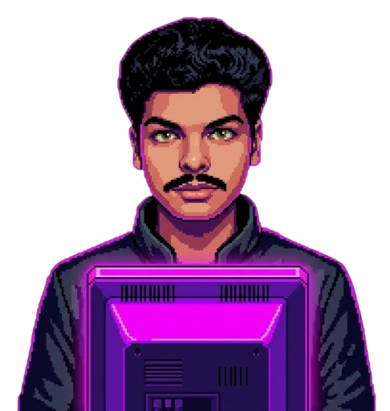

<!-- ============ HERO BANNER ============ -->

## 🎮 THE MISSION

<!-- ============ HERO: SPRITE + ANIMATED TAGLINE SIDE-BY-SIDE ============ -->
<table width="100%">
<tr>
<td width="35%" align="center" valign="middle">

</td>
<td width="65%" align="left" valign="middle">

</td>
</tr>
</table>
<!-- ============ THE MISSION (ABOUT) ============ -->

## 01 📜 THE QUEST CHAIN

<!-- ============ BATTLE LOG (LIVE GITHUB STATS) ============ -->

## 02 ⚡ BATTLE LOG
*Live activity, auto-updated*

<!-- Contribution snake — populated by GitHub Action, see .github/workflows/snake.yml -->

<!-- ============ EQUIPPED ITEMS (TOOLS & STACK) ============ -->

## 03 🛠️ Equipped Items

LANGUAGES

MACHINE LEARNING & DATA

TOOLS & ENVIRONMENT

 

## `04` &nbsp; GitHub Stats

**🏙️ Contributions, Isometric 3D**

  

 

## `05` &nbsp; Connect With Me

 

## 🕹️ TO BE CONTINUED...

Want to team up or talk AI? **[Reach out →](mailto:achinttiwari.dev@gmail.com)**

Last save point: auto-updated via GitHub Actions

