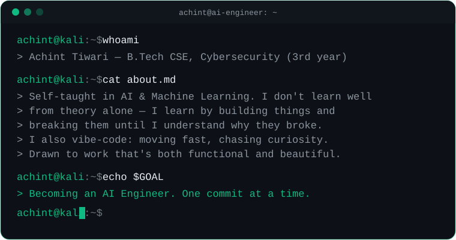

 

  

 

## `01` &nbsp; About Me

I'm currently in my **3rd year of B.Tech in Computer Science**, specializing in **Cybersecurity** — but somewhere along the way, I fell for a different kind of security: the certainty of knowing *why* a model predicts what it predicts.

I'm entirely **self-taught in AI & Machine Learning**, piecing together knowledge from scattered courses, docs, and papers across the internet. I don't learn well by reading theory in isolation — I learn by **getting my hands dirty and building**, breaking things, and figuring out why they broke. Parallelly, I **vibe-code** — moving fast, experimenting freely, and following curiosity over rigid roadmaps.

I'm drawn to projects that aren't just functional but genuinely **beautiful** — I believe strong engineering and thoughtful design were never meant to be separate disciplines.

The long-term goal is simple: become a full-fledged **AI Engineer**.

 

<table width="100%">
<tr>
<td width="50%" valign="top">

**🔭 Currently**
Mastering Python & its ML/AI libraries

**🌱 Learning**
Machine Learning fundamentals & applied deep learning

</td>
<td width="50%" valign="top">

**🛡️ Core Specialization**
Cybersecurity (B.Tech CSE)

**🎯 Long-Term Goal**
Becoming an AI Engineer

</td>
</tr>
</table>

 

## `02` &nbsp; Tech Stack

LANGUAGES

MACHINE LEARNING & DATA

TOOLS & ENVIRONMENT

 

## `03` &nbsp; GitHub Stats

**🟡 Contributions, Pac-Man Style**

<picture>
  <source media="(prefers-color-scheme: dark)" srcset="https://raw.githubusercontent.com/achinttiwari/achinttiwari/output/pacman-contribution-graph-dark.svg">
  <source media="(prefers-color-scheme: light)" srcset="https://raw.githubusercontent.com/achinttiwari/achinttiwari/output/pacman-contribution-graph.svg">
  
</picture>

⚠️ requires a one-time GitHub Action setup — see instructions below

  

**🏙️ Contributions, Isometric 3D**

  

 

## `04` &nbsp; Connect With Me

 

<b>⚙️ One-time setup: activating the Pac-Man graph</b>

 

The Pac-Man widget above needs a small GitHub Action to generate itself (GitHub doesn't allow live game logic in a static README, so it's baked into an SVG once a day):

1. In this repo, create the file `.github/workflows/pacman.yml`
2. Paste in the contents of the provided `pacman-contributions.yml` file
3. Push the change, then go to the **Actions** tab → run the workflow once manually
4. It will generate an `output` branch containing the SVG — after that, it refreshes automatically every day

<b>🩺 Troubleshooting: terminal intro not showing</b>

 

If the terminal graphic at the top shows a broken image icon instead of the animation:

1. Confirm `assets/terminal-intro.svg` was actually committed to the repo, at the exact path `assets/terminal-intro.svg` (case-sensitive), on your default branch
2. If it's there and still broken, swap the `src` in the README's `` line for this jsDelivr CDN link instead, which is more reliable for custom repo-hosted SVGs:
   `https://cdn.jsdelivr.net/gh/achinttiwari/achinttiwari@main/assets/terminal-intro.svg`

<b>🩺 Troubleshooting: stats/top-languages cards not showing</b>

 

The `github-readme-stats.vercel.app` service (used for the main stats card and top-languages card) is a free public instance that's had frequent outages and rate-limit issues recently — this is a widely reported problem with the service itself, not something wrong in your README. The streak-stats card runs on a separate, more stable service, which is why it tends to keep working even when the others don't.

If it's down for you: it usually resolves within a few hours, so a refresh later often fixes it. If you want a permanently reliable version instead of depending on the public API, let me know and I can set you up with an Action-based version (same idea as the Pac-Man graph — generates a static image daily instead of relying on a live service).

